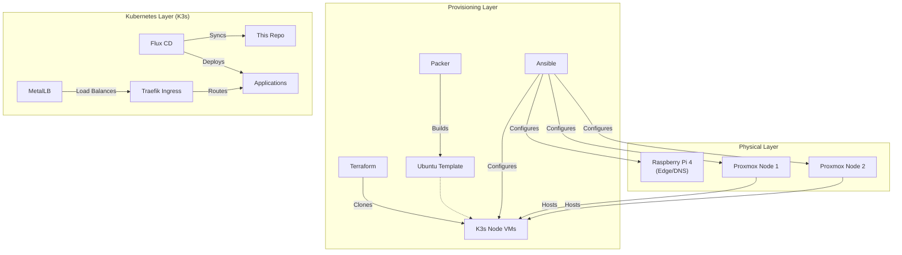

# Home Lab IaC

This is like my 4th attempt to trying to bring some order to the madness that is my home lab.

The main purpose is to slowly consolidate all the custom scripts and configurations I've put into my Proxmox nodes and also to bring down the number of VMs and LXCs I use by moving to Kubernetes.

## ⚠️ Notice

1. This repository is a massive work in progress and there's no guarantee I will ever finish it. I'll keep adding to it as I keep adding more stuff to my homelab. Or at least that's the idea.
2. The code is either written by me or written by AI and audited by me.
3. The READMEs and documentations are mostly written by AI as a way to keep track of everything and so I know WTF was going if I take a break and eventually come back to this.
4. Finally, the code isn't the best in all places. In some cases you'll see long very tailored shell commands or things that are, honestly, flaky as fuck. _The joys of homelabing_.

## 🎯 What This Actually Does

Yes yes, I know, I'm reinventing the wheel all over the place. There are already available charts and other projects to do this but... where's the fun in that? I wanted to go from scratch as a way to brush up my skills (particularly in setting up Kubernetes from scratch), get a fully custom solution... and because why not?

**What runs here:**
- A K3s Kubernetes cluster on Proxmox VMs
- Authentik for SSO (because logging in 10 times sucks)
- Standard homelab services (Pi-hole, Traefik, Monitoring)

**What manages it:**
- **Ansible:** Configures the metal and the VMs
- **Packer:** Builds the VM templates (so I don't have to install Ubuntu manually ever again)
- **Terraform:** Spawns the K3s nodes
- **Flux:** Keeps the Kubernetes cluster in sync with this repo (GitOps)

## 🏗️ High-Level Architecture



## 📚 Documentation

### New to this repo?
- [**Getting Started**](docs/GETTING_STARTED.md) - From zero to running cluster
- [**Architecture Deep-Dive**](docs/ARCHITECTURE.md) - How the sausage is made
- [**FAQ**](docs/FAQ.md) - Why I did things this way

### Core Guides
- [**Networking**](docs/NETWORKING.md) - IPs, DNS, Traefik, and routing magic
- [**Security**](docs/SECURITY.md) - What's locked down and what isn't
- [**Troubleshooting**](docs/TROUBLESHOOTING.md) - When things inevitably break

### Components
- [**Ansible**](ansible/README.md) - Configuration management
- [**Packer**](packer/README.md) - VM image building
- [**Terraform**](terraform/README.md) - Infrastructure provisioning
- [**Kubernetes**](kubernetes/README.md) - Flux GitOps & Cluster state

### Operations
- [**Disaster Recovery**](docs/DISASTER_RECOVERY.md) - Backups and restoring sanity
- [**Development Workflow**](docs/DEVELOPMENT.md) - How to contribute (or how I contribute)

### For AI Assistants
- [**AGENTS.md**](AGENTS.md) - Instructions for AI code assistants

## 🚀 Quick Start

```bash
# 1. Install dependencies
pip install ansible ansible-lint yamllint
pre-commit install

# 2. Build VM template (Packer)
cd packer/ubuntu-24.04-base
packer build .

# 3. Provision K3s nodes (Terraform)
cd ../../terraform/k3s_nodes
terraform init && terraform apply

# 4. Configure all hosts (Ansible)
cd ../../ansible
ansible-playbook -i inventories/baremetal.yml playbooks/rpi.yml
# (See docs/GETTING_STARTED.md for the full walkthrough)
```

## 🛠️ Tech Stack

- **Infrastructure:** Proxmox VE, Ubuntu 24.04
- **Provisioning:** Packer, Terraform, Ansible
- **Kubernetes:** K3s
- **GitOps:** Flux
- **Networking:** Traefik, MetalLB, cert-manager, ExternalDNS
- **Storage:** Longhorn
- **Observability:** Prometheus, Grafana, Loki, Alloy
- **Auth:** Authentik (SSO)
- **Secrets:** Bitwarden Secrets Manager

## Repository Structure

```
home-lab-iac/
├── ansible/                    # Configuration management
├── packer/                     # VM image templates
├── terraform/                  # Infrastructure provisioning
├── kubernetes/                 # Flux GitOps configuration
│   ├── clusters/homelab/       # The actual cluster state
│   │   ├── apps/               # User applications
│   │   ├── flux-system/        # Flux config & sync definitions
│   │   ├── infrastructure/     # Core infra apps (Traefik, Storage, etc.)
│   │   └── secrets/            # Secret definitions
│   └── samples/                # Templates for new apps
├── docs/                       # Detailed documentation
├── .github/                    # CI/CD workflows
└── AGENTS.md                   # Development guidelines for AI
```

## Security Considerations

- 🔒 SSH keys committed directly in Ansible inventory files (public keys only, mostly)
- 🛡️ Proxmox API tokens stored securely (env vars), never committed
- 🔐 Root login disabled on all hosts except Proxmox management
- 📝 Automated security updates on edge devices
- 🔍 Regular dependency updates and vulnerability scanning
- See [**Security Guide**](docs/SECURITY.md) for details.

## License / Usage

This is a personal project. Use at your own risk. No warranty implies, and I'm not responsible if this blows up your homelab. 💥
