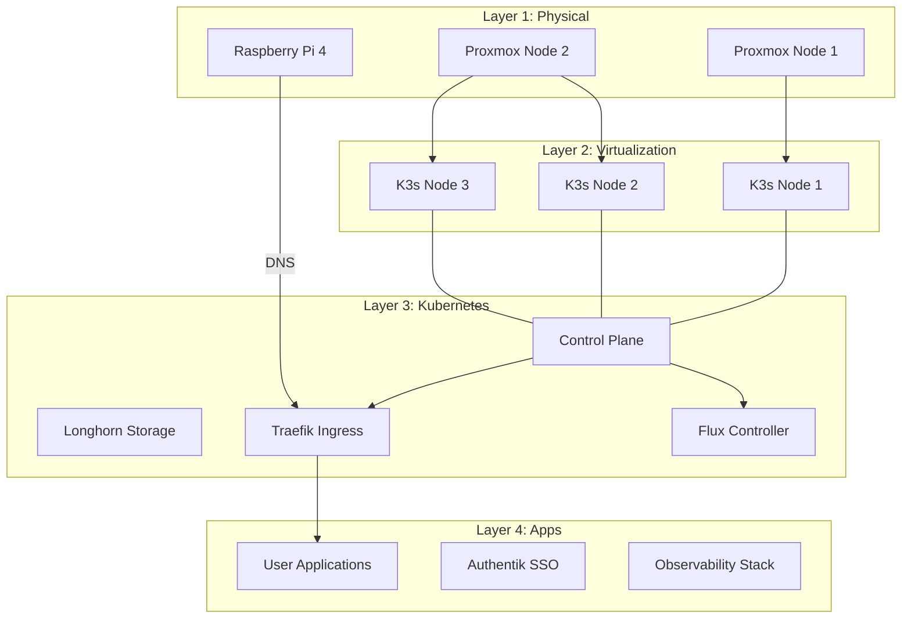
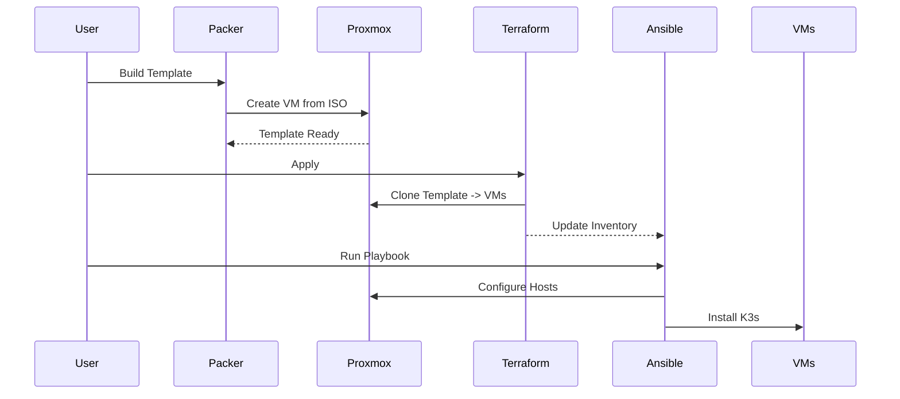
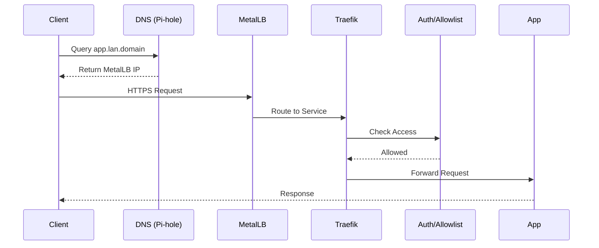

# Architecture Deep-Dive

## Philosophy

Why build this? Because clicking around Proxmox UI and manually configuring servers gets old fast. Also, hobbies are weird.

## Why Reinvent the Wheel?
- **Learning:** Hands-on with IaC, GitOps, K8s is the best way to learn.
- **Control:** I know exactly what's running and where.
- **Fun:** Homelabs are playgrounds.
- **Overkill:** Absolutely, but that's the point.

## Design Goals
- **Declarative:** Everything in Git. If it's not in Git, it doesn't exist.
- **Reproducible:** Blow it away, rebuild from scratch with minimal manual intervention.
- **Automated:** Minimize manual steps (except for the initial bootstrap).
- **Documented:** Future me needs to remember why I did X instead of Y.

## Non-Goals
- **Production-ready enterprise solution:** This is a homelab.
- **High availability:** If it goes down, I fix it. I don't need 99.999% uptime.
- **Perfect security:** It's on my LAN. I secure what makes sense, but I'm not Fort Knox.
- **Scalability to thousands of nodes:** I have 3 servers.

## System Architecture Overview

## Component Layers

### Layer 1: Physical Infrastructure
**Proxmox Hosts (pve1, pve2)**
- **Hardware:** Generic x86 hardware
- **Network:** `192.168.1.0/24` (Management)
- **Storage:** ZFS pools for VM disks
- **Purpose:** VM hosting, raw compute

**Raspberry Pi (main-rpi4) - To be replaced soon**
- **Hardware:** RPi 4
- **Network:** `192.168.1.6`
- **Purpose:** Clusters don't like even numbers.
- **Why not in K8s?** I need DNS to work even if the cluster is down.

### Layer 2: Virtualization (Packer + Terraform)
**Packer: Template Building**
- **Process:** ISO → Packer → Template
- **Creates:** Ubuntu 24.04 base template
- **Includes:** cloud-init, qemu-guest-agent, base packages
- **Why:** Consistency, speed (clone vs. install from ISO every time)

**Terraform: VM Provisioning**
- **Process:** Template → Terraform → VMs
- **Creates:** K3s node VMs
- **Network:** VLAN 10 (`192.168.10.0/24`)
- **Output:** Ansible inventory (`ansible/inventories/k3s-nodes.yml`)

### Layer 3: Configuration (Ansible)
**Ansible: Config Management**
- **Scope:** Bare metal & VMs
- **Roles:**
    - `common`: All hosts (SSH, NTP, packages)
    - `vms`: VM-specific (disk expansion, qemu-agent)
    - `k3s`: Kubernetes binary installation and OS tuning

### Layer 4: Kubernetes (K3s)
**K3s Distribution**
- **Why K3s?** Lightweight, simple (single binary), perfect for homelab.
- **vs. K8s:** Less overhead, easier management.
- **vs. Docker Compose:** More features, better learning experience for cloud-native tech.

**Cluster Setup:**
- **Nodes:** VMs distributed across Proxmox hosts.
- **Storage:** Longhorn (distributed block storage using secondary virtual disks).
- **Networking:** Flannel CNI.
- **Ingress:** Traefik.
- **Load Balancer:** MetalLB (Layer 2 mode).

### Layer 5: GitOps (Flux)
**Flux CD**
- **Watches:** This repo (`kubernetes/clusters/homelab`)
- **Applies:** HelmReleases, Kustomizations
- **Reconciles:** Every 10 minutes (or on webhook)

**Flux Structure:**
- `sources`: HelmRepositories (where charts come from)
- `infrastructure`: Core services (Traefik, cert-manager, etc.)
- `apps`: User applications

### Layer 6: Infrastructure Services
**Traefik (Ingress Controller)**
- **Entry points:** web (80), websecure (443)
- **Routing:** Host-based (`*.lan.<DOMAIN>` and `*.<DOMAIN>`)
- **Middlewares:** LAN allowlist, Authentik auth
- **SSL:** Automatic via cert-manager

**cert-manager (Certificate Management)**
- **Issuer:** Let's Encrypt (Production)
- **Challenge:** DNS-01 via Cloudflare API
- **Wildcard:** `*.lan.<DOMAIN> and *.<DOMAIN>`

**MetalLB (Load Balancer)**
- **Mode:** L2 Advertisement
- **Why:** Bare-metal doesn't have a cloud LoadBalancer (like AWS ELB). MetalLB announces IPs on the LAN.

**Longhorn (Storage)**
- **Replicas:** 2 (across nodes)
- **Backend:** Secondary virtual disk (`/dev/sdb`)
- **Why:** Persistent storage that moves with pods if a node dies.

**external-dns (DNS Automation)**
- **Provider:** Pi-hole (via webhook/API) or Cloudflare
- **Pattern:** `*.lan.<DOMAIN>` or `*.<DOMAIN>` → MetalLB IPs
- **Why:** No manual DNS entries.

**Authentik (SSO)**
- **Type:** Identity Provider (IdP)
- **Integration:** Traefik forward auth middleware
- **Use case:** Protect internal apps that don't have their own auth.

**Bitwarden Secrets Manager**
- **Purpose:** Inject secrets into Kubernetes from external vault.
- **Operator:** BitwardenSecret CRDs.
- **Why:** No secrets in Git. Period.

### Layer 7: Observability
**Prometheus Stack**
- **Metrics:** All infrastructure + apps
- **Exporters:** Node, kube-state-metrics

**Grafana**
- **Dashboards:** Pre-configured via code
- **Data sources:** Prometheus, Loki

**Loki**
- **Purpose:** Log aggregation
- **Collection:** Alloy (formerly Promtail/Grafana Agent)

**Alloy**
- **Collects:** Logs, metrics
- **Sends to:** Loki, Prometheus

## Data Flows

### Provisioning Flow

### Traffic Flow (Ingress)

## Technology Choices & Alternatives

### Why K3s over K8s?
- **K3s:** 1 binary, low memory footprint, includes basics (Traefik, metrics-server).
- **K8s (kubeadm):** Complex setup, high resource usage.
- **Decision:** K3s is perfect for resource-constrained homelabs.

### Why Flux over ArgoCD?
- **Flux:** GitOps native, headless (mostly), uses K8s native CRDs effectively.
- **ArgoCD:** Great UI, but heavier.
- **Decision:** I use ArgoCD at work. I wanted something different.

### Why Traefik over Nginx?
- **Traefik:** Dynamic configuration, great CRDs (IngressRoute), built-in middlewares.
- **Nginx:** Standard, but config reload can be annoying.
- **Decision:** Traefik's middleware system is a killer feature for homelab (easy auth/allowlists).

### Why Longhorn over Rook/Ceph?
- **Longhorn:** Easy GUI, simple setup, works on top of existing filesystems.
- **Rook/Ceph:** Powerful but complex, easier to break, harder to fix.
- **Decision:** Longhorn is "good enough" block storage without the headache.

## Failure Modes & Resilience

### Proxmox Host Down
- **Impact:** VMs on that host stop. K3s pods reschedule to other nodes (if capacity allows). Longhorn rebuilds replicas.
- **Recovery:** Power on host. VMs auto-start. Cluster self-heals.

### Internet Down
- **Impact:** Can't pull new images. Can't renew certs (but existing ones work). DNS resolution for external sites fails.
- **Status:** Internal LAN services continue to function.

### All Power Lost
- **Impact:** Silence.
- **Recovery:** BIOS set to "Always On". Proxmox boots -> VMs boot -> K3s starts -> Flux reconciles. Time to recovery: ~5-10 mins.

## Scaling Considerations

### Add K3s Nodes
1. Increase `node_count` in Terraform variables.
2. `terraform apply`.
3. Run Ansible playbook.
4. Profit.

### Add Services
1. Create HelmRelease YAML in `kubernetes/clusters/homelab/apps`.
2. Commit to Git.
3. Flux syncs and deploys.
