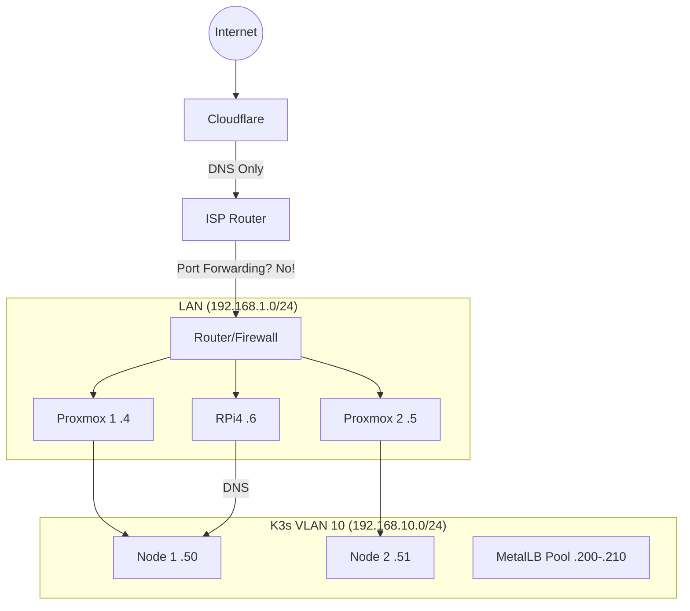
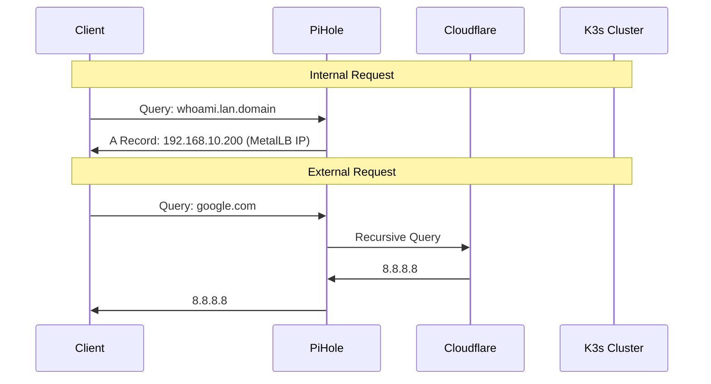

# Networking Guide

Network engineering: where "it's always DNS" is a law of physics.

## Network Overview



## IP Addressing Scheme

### Management Network (`192.168.1.0/24`)
The physical/management layer.

| Host | IP | Purpose |
|------|-----|---------|
| **Gateway** | `192.168.1.1` | Router |
| **pve1** | `192.168.1.4` | Proxmox Host 1 |
| **pve2** | `192.168.1.5` | Proxmox Host 2 |
| **main-rpi4** | `192.168.1.6` | Raspberry Pi |

### Internal/K3s VLAN (`192.168.10.0/24`, VLAN 10)
Isolated network for Kubernetes nodes.

| Host | IP | Purpose |
|------|-----|---------|
| **Gateway** | `192.168.10.1` | VLAN Interface on Router |
| **Pi-Hole** | `192.168.10.2` | Primary DNS and adblocker - Using unbound and cloudflared |
| **k3s-node-xx** | `192.168.10.50`+ | K3s Virtual Machines |
| **MetalLB Pool** | `192.168.10.200-240` | LoadBalancer Service IPs |

### LAN Allowlist Ranges
These ranges are trusted by the `services-lan-allowlist` middleware.
- `192.168.0.0/16` - Main LAN supernet
- `10.1.20.0/27` - VPN/Wireguard range (if applicable)

## DNS Architecture

### Components
1.  **Pi-hole (`192.168.10.2`)**: The primary DNS server for the LAN. Handles ad-blocking and local domain resolution.
2.  **Cloudflare**: Public DNS provider. Manages the real domain (`example.com`).
3.  **external-dns**: Kubernetes controller that syncs Ingress hostnames to DNS providers.
4.  **coredns**: Internal Kubernetes DNS.

### DNS Flow


### Automation (external-dns)
I use `external-dns` to automatically create DNS records.
- **Source:** Kubernetes Ingress / Service
- **Target:** Pi-hole (via CRD/Webhook or RFC2136) or Cloudflare
- **Pattern:** `*.lan.<DOMAIN>` -> Private MetalLB IP

## Routing & Ingress (Traefik)

Traefik acts as the entry point for all HTTP/HTTPS traffic entering the cluster.

### Entry Points
- **web (80):** Global redirect to HTTPS.
- **websecure (443):** Main HTTPS entry point. TLS required.

### Routing Modes
1.  **Ingress (`kind: Ingress`):** Standard Kubernetes ingress. Used for most simple web apps.
2.  **IngressRoute (`kind: IngressRoute`):** Traefik custom resource. Used for the dashboard and complex routing.

### Middlewares

**1. LAN Allowlist (`lan-allowlist`)**
- Blocks any traffic not originating from private IP ranges.
- Applied to almost everything to prevent accidental internet exposure.

**2. Authentik Forward Auth (`authentik`)**
- Offloads authentication to the SSO provider.
- If user isn't logged in, redirects to Authentik login page.
- Passes user info headers (`X-Authentik-Username`) to the app.

**Example Usage:**
```yaml
annotations:
    traefik.ingress.kubernetes.io/router.middlewares: >-
      services-lan-allowlist@kubernetescrd,
      services-authentik-forwardauth@kubernetescrd
```

## SSL/TLS Certificate Management

Certificates are handled by **cert-manager**.

### The "Private Public" Certificate
Even though my services are internal (`192.168.x.x`), I use valid **public Let's Encrypt certificates**.

**How?**
1.  **DNS-01 Challenge:** Let's Encrypt validates ownership by checking a TXT record in Cloudflare DNS.
2.  It does *not* need to connect to my server.
3.  cert-manager uses my Cloudflare API Token to create the TXT record.
4.  Let's Encrypt issues a wildcard cert: `*.lan.<DOMAIN>`.
5.  Traefik serves this cert.

**Result:** Green lock icon on internal IP addresses. No "Not Secure" warnings.

## Load Balancing (MetalLB)

**MetalLB** runs in **Layer 2 Mode**.
- It "announces" IPs on the local network using ARP (like a physical machine plugging in).
- When you create a Service of `type: LoadBalancer`, MetalLB assigns it an IP from the pool.
- Traefik has a LoadBalancer service, effectively becoming the "router" for the cluster.

## Network Troubleshooting

### "I can't reach my app!"
1.  **DNS:** `nslookup app.lan.<DOMAIN> 192.168.1.6` -> Does it return an IP?
2.  **Ping:** Can you ping the MetalLB IP?
3.  **Ingress:** `kubectl get ingress -A` -> Is the address populated?
4.  **Traefik Logs:** `kubectl logs -n traefik -l app.kubernetes.io/name=traefik`
5.  **Middleware:** Did you apply the allowlist and are testing from a weird VLAN?

### "Certificate Error / Not Secure"
1.  Check cert-manager: `kubectl get certificate -A`
2.  Check the order: `kubectl describe order -A`
3.  Check Cloudflare: Did the TXT record get created?
