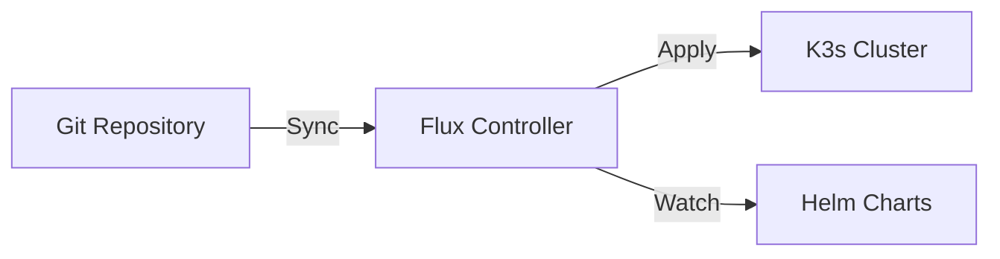

# Kubernetes GitOps

This directory is the heart of the cluster. It is managed by **Flux CD**.

## 🏗️ GitOps Workflow



Everything in this folder is applied to the cluster automatically. **Do not run `kubectl apply` manually** for anything in this folder (except secrets), or Flux will overwrite your changes.

## 📂 Directory Structure

```
kubernetes/
├── clusters/
│   └── homelab/              # The definition of MY cluster
│       ├── apps/             # User applications (whoami, media, etc.)
│       ├── flux-system/      # Flux configuration (gotk-components, sync)
│       ├── infrastructure/   # Core services (Traefik, Cert-Manager, etc.)
│       └── secrets/          # Secret definitions (Bitwarden)
└── samples/                  # Templates for new apps
```

## 🚀 How to Add a New Application

### 1. Choose a Type
- **Helm Chart:** Use `HelmRelease` (preferred).
- **Plain YAML:** Use standard Kubernetes manifests.

### 2. Create the Manifest
Use the template in `kubernetes/samples/helm_release_template.yaml`.

**Example `apps/my-app.yaml`:**
```yaml
apiVersion: helm.toolkit.fluxcd.io/v2
kind: HelmRelease
metadata:
  name: my-app
  namespace: flux-system
spec:
  targetNamespace: my-app
  interval: 30m
  chart:
    spec:
      chart: my-app-chart
      sourceRef:
        kind: HelmRepository
        name: my-repo
        namespace: flux-system
  values:
    # App config...
```

### 3. Commit and Push
```bash
git add .
git commit -m "Add my-app"
git push
```

### 4. Wait or Force Sync
Flux checks every 10 minutes. To force it:
```bash
flux reconcile source git flux-system
```

## 🔐 Secret Management

We use **Bitwarden Secrets Manager**.

1.  **Do not commit secrets.**
2.  Create secret in Bitwarden.
3.  Create `BitwardenSecret` CRD (see `secrets/README.md`).
4.  Flux applies CRD -> Operator creates Secret -> App uses Secret.

## 🛠️ Infrastructure Components

Each major component has its own documentation:

- [**Traefik**](clusters/homelab/infrastructure/traefik/README.md) - Ingress & Routing
- [**Authentik**](clusters/homelab/infrastructure/authentik/README.md) - SSO & Identity
- [**Observability**](clusters/homelab/infrastructure/observability/README.md) - Monitoring Stack
- [**Longhorn**](clusters/homelab/infrastructure/longhorn/README.md) - Distributed Storage
- [**CloudNative-PG**](clusters/homelab/infrastructure/cloudnative-pg/README.md) - PostgreSQL
