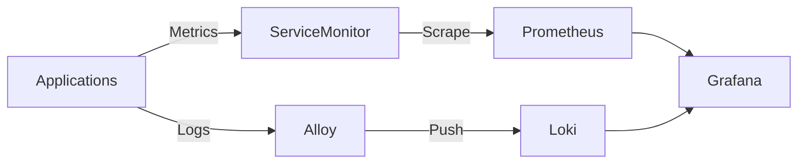

# Observability Stack

We're using mostly Grafana stack. Grafana, Prometheus, Loki and Alloy.

## Components

| Component | Purpose | URL |
|-----------|---------|-----|
| **Prometheus** | Metrics database | `prometheus.lan.<DOMAIN>` |
| **Grafana** | Visualization dashboard | `grafana.lan.<DOMAIN>` |
| **Loki** | Log aggregation | (Internal) |
| **Alloy** | Collector agent | (Internal) |
| **Alertmanager** | Alerting | (Internal) |

## Monitoring Pipeline



## How to Monitor Your App

### 1. Metrics (Prometheus)
If your app exposes metrics (e.g., `/metrics` endpoint):

1.  **Enable Metrics in App:** Ensure the endpoint is active.
2.  **Create ServiceMonitor:** Tell Prometheus to scrape it.

```yaml
apiVersion: monitoring.coreos.com/v1
kind: ServiceMonitor
metadata:
  name: my-app
  namespace: observability # Or where the operator watches
spec:
  selector:
    matchLabels:
      app: my-app
  endpoints:
    - port: http
      path: /metrics
```
*Note: Our Prometheus is configured to discover ServiceMonitors in ALL namespaces.*

### 2. Logs (Loki)
Logs are automatically collected for all pods via Alloy (running as a DaemonSet).
- **View:** Go to Grafana -> Explore -> Data Source: Loki.
- **Query:** `{namespace="my-app"}`.

## Dashboards

Dashboards are managed as code in `config/dashboards/`.
- **Node Exporter:** Hardware stats (CPU, RAM, Disk).
- **K3s:** Cluster internals.
- **Traefik:** Request rates, latency, errors.

## Troubleshooting

### "No Data" in Grafana
1.  Check if Prometheus target is UP: `http://prometheus.lan.<DOMAIN>/targets`
2.  Check if ServiceMonitor matches the Service labels exactly.
3.  Check if the pod is actually exposing metrics (`curl <pod-ip>:metrics`).

### "Logs missing"
1.  Check Alloy pods: `kubectl get pods -n observability -l app.kubernetes.io/name=alloy`
2.  Check if the app logs to stdout/stderr (Loki captures stdout, not files inside the container).
