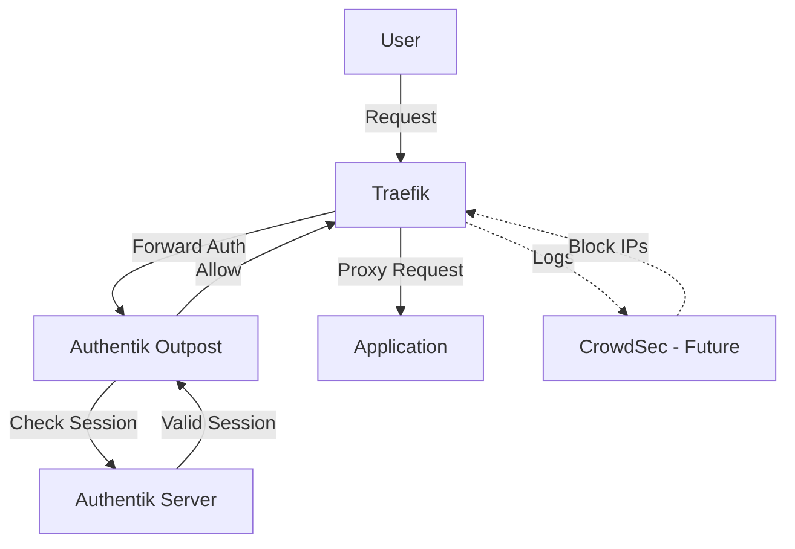

# Security Infrastructure

Security-focused infrastructure components for the homelab cluster.

## Components

| Component | Purpose | Namespace | Status |
|-----------|---------|-----------|--------|
| [**Authentik**](./authentik/README.md) | Identity Provider (SSO) | `authentik` | ✅ Deployed |
| **CrowdSec** | Intrusion Prevention System (IPS) | `crowdsec` | 🚧 Planned |

## Architecture



## Current Setup

### Authentik (Identity Provider)
- **Type:** SSO/IdP with forward auth integration
- **Integration:** Traefik middleware (`traefik-authentik@kubernetescrd`)
- **Database:** PostgreSQL (CloudNative-PG)
- **Use Case:** Protect internal apps without native authentication

See [Authentik README](./authentik/README.md) for setup and usage details.

## Future Components

### CrowdSec (Planned)
- **Type:** Intrusion Prevention System
- **Purpose:** Detect and block malicious traffic
- **Integration:** Traefik bouncer + log analysis
- **Data Sources:** Traefik logs, system logs

## Adding Security to Your App

### Method 1: Authentik Forward Auth (Recommended)

Add the Authentik middleware to your Ingress:

```yaml
apiVersion: networking.k8s.io/v1
kind: Ingress
metadata:
  annotations:
    traefik.ingress.kubernetes.io/router.middlewares: >-
      traefik-lan-allowlist@kubernetescrd,
      traefik-authentik@kubernetescrd
spec:
  # ... rest of ingress config
```

**Requirements:**
1. Create Application in Authentik UI
2. Create Provider (Proxy type)
3. Add annotation to Ingress

See [samples/stateless_web_app_with_authentik.yaml](../../../../samples/stateless_web_app_with_authentik.yaml) for full example.

### Method 2: Native App Authentication

For apps with built-in auth (like Grafana, Longhorn), you can:
- Use Authentik as OIDC provider (if app supports it)
- Use app's native auth + LAN allowlist middleware
- Combine both for defense in depth

## Security Best Practices

1. **Layered Security:**
   - LAN allowlist (network level)
   - Authentik (authentication level)
   - App-level permissions (authorization level)

2. **Secrets Management:**
   - Never commit secrets to Git
   - Use Bitwarden Secrets Manager operator
   - Rotate credentials regularly

3. **Network Policies:**
   - Implement Kubernetes NetworkPolicies where appropriate
   - Default deny, explicit allow

4. **Monitoring:**
   - All security components expose metrics (Prometheus)
   - Logs aggregated to Loki
   - Set up alerts for authentication failures

## Troubleshooting

### Authentik Redirect Loop
- Check middleware order (allowlist before auth)
- Verify Authentik outpost is running
- Check Application configuration in Authentik UI

### Can't Access Protected App
- Verify you're on LAN network (if allowlist enabled)
- Check Authentik session validity
- Review Traefik logs: `kubectl logs -n traefik -l app.kubernetes.io/name=traefik`

## Related Documentation

- [Traefik Configuration](../traefik/README.md)
- [Observability Stack](../observability/README.md)
- [Network Architecture](../../../../../docs/NETWORKING.md)
- [Security Guidelines](../../../../../docs/SECURITY.md)
