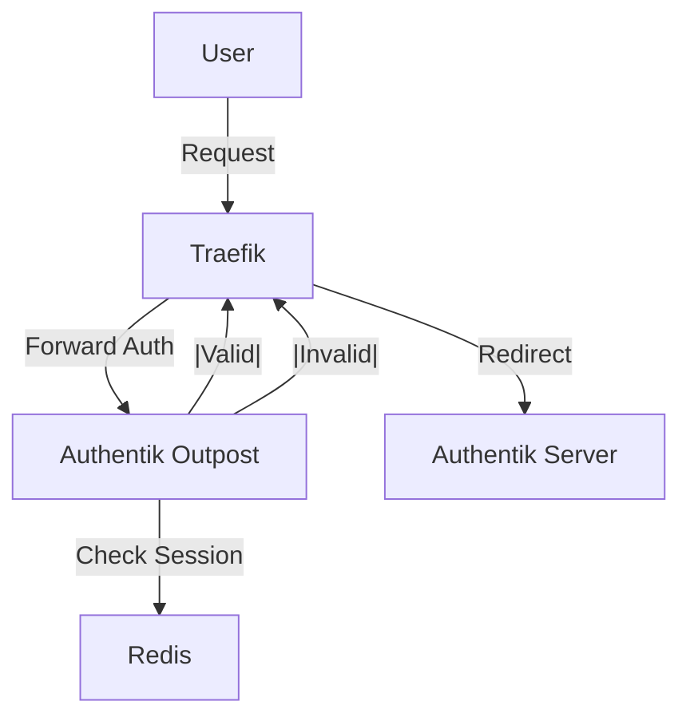

# Authentik Manual Setup & Architecture

Authentik is our Identity Provider (IdP). It handles Single Sign-On (SSO) for internal services.

## Architecture



## Initial Setup Guide

### 1. Access Initial Setup
After deployment, go to `https://sso.lan.<DOMAIN>/if/flow/initial-setup/`.
- Set the `akadmin` password.

### 2. Create the Outpost
The outpost is the "proxy" that sits between Traefik and the Server.
1.  **Admin Interface** -> Applications -> Outposts.
2.  **Create New Outpost**:
    - **Name:** `internal-auth-outpost`
    - **Type:** `Proxy`
    - **Integration:** `Kubernetes Service` (select `Local Kubernetes Cluster`)
    - **Authentik host:** `http://authentik-server.authentik.svc.cluster.local`
    - **Browser URL:** `https://sso.<DOMAIN>` (public URL users reach)
    - **Applications:** Select apps you want to protect.

> Note: The outpost controller creates its own Service/Ingress in the
> `authentik` namespace. If you use the same host (`sso.<DOMAIN>`) for the
> Authentik server ingress, make sure callbacks under
> `/outpost.goauthentik.io/` are routed to the outpost; otherwise you'll see a
> 404 "not found" after login.

### 3. Create a Proxy Provider
For generic forward auth (protecting apps that don't support OIDC):
1.  **Applications** -> Providers -> Create `Proxy Provider`.
2.  **Name:** `generic-forward-auth`.
3.  **Forward Auth Mode:** `Single Application` or `Domain Level` (Domain level allows sso for `*.lan.domain`).
4.  **External Host:** `https://app.lan.<DOMAIN>`.

### 4. Create an Application
1.  **Applications** -> Applications -> Create.
2.  **Name:** `My App`.
3.  **Slug:** `my-app`.
4.  **Provider:** Select the provider created above.

## Integration with Traefik

We use a Middleware in Traefik to enforce auth.

**File:** `kubernetes/clusters/homelab/infrastructure/traefik/config/authentik-middleware.yaml`

```yaml
apiVersion: traefik.io/v1alpha1
kind: Middleware
metadata:
  name: authentik
spec:
  forwardAuth:
    address: http://ak-outpost-internal-auth-outpost.authentik.svc.cluster.local:9000/outpost.goauthentik.io/auth/traefik
    # ... headers ...
```

**Usage:**
Add annotation to Ingress:
```yaml
traefik.ingress.kubernetes.io/router.middlewares: traefik-authentik@kubernetescrd
```

## Database
Authentik uses **PostgreSQL** (managed by CloudNative-PG).
- **Credentials:** Managed by Bitwarden secrets.
- **Backup:** PG backups configured in CNPG cluster definition.
