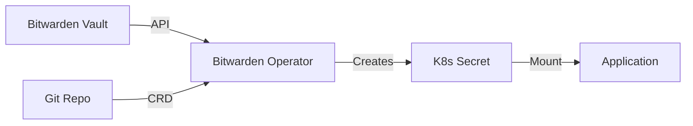

# Secret Management

We use **Bitwarden Secrets Manager** to inject secrets into the cluster.

## Architecture



## Security Best Practices (Ideal)

1.  **Never Commit Secrets:** If you commit a password, it is burned. Rotate it immediately.
2.  **Use IDs:** Only commit the Bitwarden Secret ID (UUID).
3.  **Least Privilege:** Create separate Bitwarden Machine Accounts for different clusters/namespaces if possible.

## Security Best Practices (That I'm actually following)

1.  **Never Commit Secrets:** If you commit a password, it is burned. Rotate it immediately.
2.  **Only samples:** We're committing sample files on how to create the needed secrets. We're not even committing Org IDs and Secret IDs.

## Workflow: Adding a Secret

### 1. Create in Bitwarden
1.  Go to Bitwarden Secrets Manager.
2.  Create a secret (e.g., `GRAFANA_ADMIN_PASSWORD`).
3.  Copy the `ID`.

### 2. Create the CRD
Create a YAML file in this directory (or inside the app's folder):

```yaml
apiVersion: k8s.bitwarden.com/v1
kind: BitwardenSecret
metadata:
  name: grafana-admin
  namespace: observability
spec:
  organizationId: "<ORG_ID>"
  secretName: grafana-admin # Name of the resulting K8s secret
  map:
    - bwSecretId: "<SECRET_ID>"
      secretKeyName: admin-password # Key in the K8s secret
```

### 3. Commit and Sync
Flux applies the CRD. The operator fetches the value.

### 4. Verify
```bash
kubectl get secret grafana-admin -n observability -o jsonpath='{.data.admin-password}' | base64 -d
```

## Bootstrap Secrets
Some secrets are needed *before* the operator can run (e.g., the Bitwarden Access Token itself).
These are created manually. See `bitwarden-authentik-secret.sample.yaml` for templates.

## Replication
We use `kubernetes-replicator` to copy the main `bw-access-token` to other namespaces so the operator can work everywhere.

**Annotation:**
```yaml
apiVersion: v1
kind: Secret
metadata:
  name: bw-access-token
  annotations:
    replicator.v1.mittwald.de/replicate-to: "flux-system,cert-manager,observability"
```
